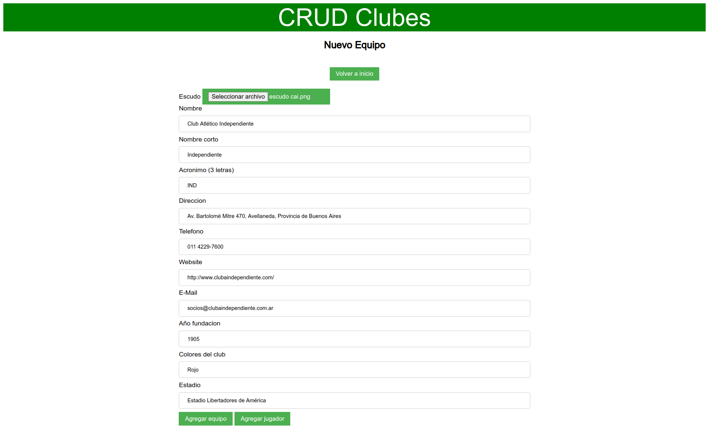

# crud-clubes

Proyecto de Node.js para https://github.com/r-argentina-programa

Tecnologías utilizadas:
* Express.js
* Handlebars
* Multer

```
npm install  
npm run start (producción)  
npm run dev (desarrollo)  
```


---



---


---


